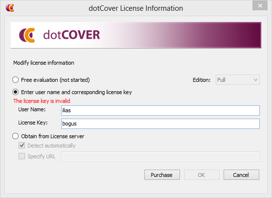

# License management in popular applications	 #

## Intro ##

As a software developer who aims to end up in product development (i.e. the development of applications for general, public use), I know that someday, I will need to create some sort of protection for a non-free application.

Most current paid-for software relies on a so called *license key* or *serial*. More importantly, a lot of applications come in the form of a free trial that can be "fully unlocked" by entering this license key.

My goal, for this assignment, was to have a look at how this protection is implemented in currently available, non-free software, looking at the various ways this may be circumvented (by creating and applying a crack) or defeated (by creating a keygen - Key Generator). The educational value in this whole endeavour is to figure out popular solutions, their relative safety, and ways in which this could be done better.

At the start of this project, I was not aware of the availability and level of functionality of high level CLR decompilers, and as such, went through the processes described in this paper in a much longer winded and complicated manner.

## JetBrains dotCover ##

[JetBrains dotCover](http://www.jetbrains.com/dotcover/) is a .NET unit test runner and code coverage tool that integrates with Visual Studio. JetBrains' set of Visual Studio plugins is widely popular, judging by the number of times one of their various tools is recommended on sites such as [stackoverflow](http://stackoverflow.com).

I chose this piece of software for various reasons. After some research, I could not find an existing keygen for it, anywhere. Not only that, but there is a free, 30-day trial available for it. It is also a fairly small and simple application, so I wouldn't have to grasp the flow through a huge application, but rather, I'd be able to assume that most of the license-key logic would be found in one single place. Last but not least, being part of a suite made me wonder whether the other tools in the suite would have similar protection schemes.

A dotCover license does not come cheap. A single seat for a commercial license runs at €189. A personal license goes for €94. There are free classroom (for trainers and educational institutions) and open source licenses, though.

Other tools available in this suite are comparably expensive. A commercial license for dotTrace Memory + Performance professional edition (memory and performance profilers for .NET applicaitons) will cost you €712+BTW for a single seat. ReSharper, one of the flagship products developed by JetBrains, will lighten your wallet by €332+BTW. The point being, this is professional software, written by people with deep insights into the way .NET applications work, are built, and with plenty of expertise writing professional grade software.

### Time for a little background information ###

What we commonly call .NET applications, are in fact, applications written in one (or more) of the languages written for the *CLR*, leveraging the .NET framework. The *CLR* or *Common Language Runtime* is, much like the *JVM* (*Java Virtual Machine*), a runtime that executes applications by interpreting and JITing (*Just In Time* compilation) so called *CIL*, *Common Intermediate Language*. The CLR is actually Microsoft's  implementation of the CLI (Common Language Infrastructure) standard. Other implementations of the CLI standard include *Shared Source Common Language Infrastructure* - Microsoft's reference implementation released under their Shared Source licensing program, Microsoft Silverlight - an implementation designed for use on the web, and Mono, a well known open source implementation of CLI and accompanying technologies.

This is very comparable to Java bytecode. Not only their pipeline is very similar, their implementation as well: both *CIL* and Java bytecode are an assembler like language, running in a stack-based (vs. the usual register based) virtual machine of runtime, and both are object oriented. One major difference is that the CIL is completely statically typed while the java bytecode instructionset has some support for dynamically typed languages built-in.

Like in the JVM world where Java is not the only language that can be compiled to something the JVM can run, there are a number of languages that can easily be compiled down to something the CLR can run.

Examples of languages that can be compiled down to CIL include C#, Visual Basic .NET, F# and C++/CLI.

### High level .NET decompilers ###

By default, a lot of symbols are retained when code is compiled down to CIL. This makes it possible to reverse engineer the original high-level code based only on the executables. Programs that are capable of not only disassembling the CIL (such as ILDasm) are referred to as decompilers.

For these decompilers, it doesn't matter much in what language the application was originally written in, most can be reversed based solely on the CIL. Some of these decompilers - such as JetBrains' dotPeek and Telerik's JustDecompile - allow to decompile to C# only, while others may also optionally decompile to other languages, such as RedGate's Reflector which is capable of decompiling to VB.Net and F# as well.

### Finding a starting point ###

DotCover doesn't come packaged as a single executable. Instead, it is a bunch of dll's, as well as an executable for command-line use. Not just *a couple* of dll's. No, 193 dll's and 16 executables.

Trying to blindly find and decompile whichever (set of) dll's and/or executables might be handling the license verification is akin to finding a needle in a haystack. So, we'll try a different approach. By entering a bogus license, we can be fairly certain that the license will be checked, and some sort of error message will be displayed. If we find the code responsible for displaying that message, we should be able to backtrack down the application, searching for (and hopefully finding) the root of our problem - the code that checked our bogus license and decided it was, well, bogus.

Now we know that dotCover will show us a lovely *The license key is invalid* message upon entering a bogus License Key. Let's try to find all the dll's that mention this string somewhere, and hope that this will narrow it down somewhat. Searching for a string within the contents of a file seems like a regular day at work for `strings` and `grep`. Since we're in windows, though, we'll leverage some powershell functionality to replace the grep call, and use a downloaded `strings` executable.

    C:\Program Files (x86)\JetBrains\dotCover\v2.2\Bin> strings *.dll | where {$_ -match "The license key is invalid"}
    .\JetBrains.Platform.dotCover.Shell.dll: The license key is invalid
    .\JetBrains.Platform.dotCover.UI.dll: The license key is invalid

Okay, so it appears in 2 dll's. That's not so bad. Especially not since they both seem to be related to some sort of front-end. The *Shell* dll is most likely leveraged in the command line tool, while the *UI* dll seems like it's more likely to have been responsible for displaying the failure message.